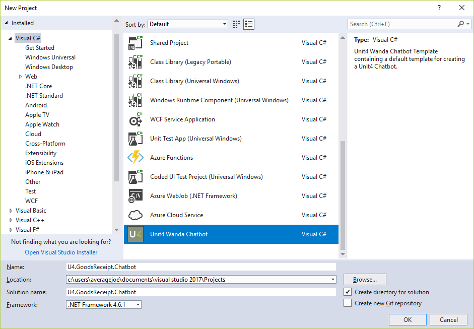
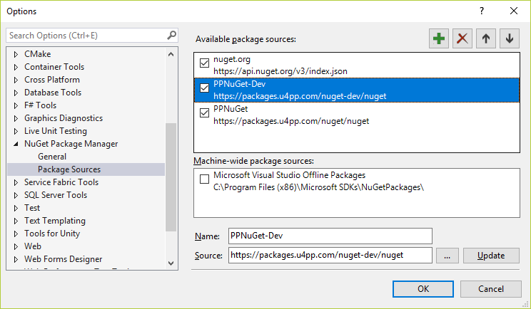
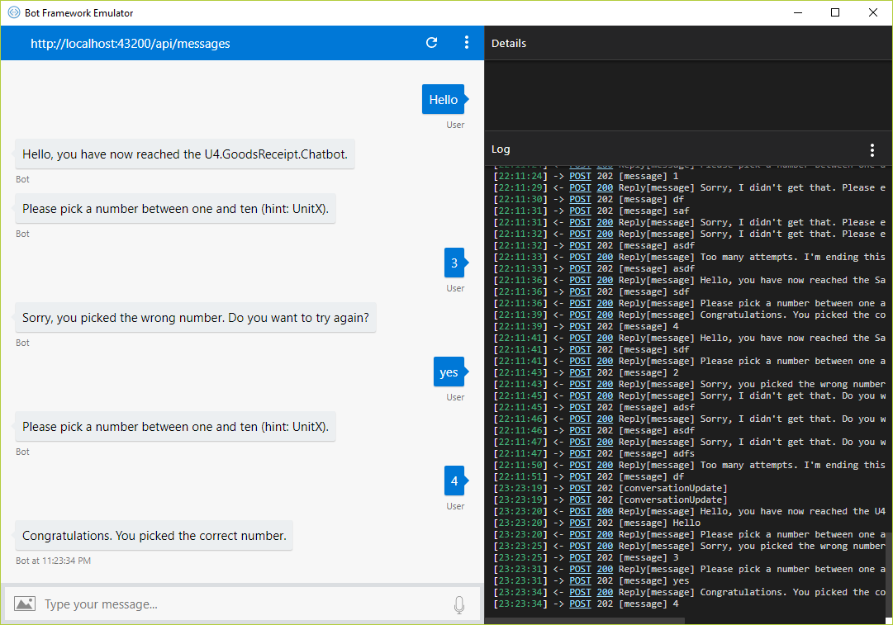

# Wanda Chatbot Visual Studio Project Template

> This topic applies to v3 of the U4.Bot.Builder. 

A Visual Studio 2015/2017 Project Template is available for setting up a Wanda chatbot.



You can download the template from [here](files/U4.Wanda.Chatbot.ProjectTemplate.zip).

## Project structure
After installing and creating a new template structure, four projects are generated and named according to the initial project name given. Assuming that the initial project name was `U4.GoodsReceipt.Chatbot`, these projects will be created:

- [U4.GoodsReceipt.Chatbot](###U4.GoodsReceipt.Chatbot)
- [U4.GoodsReceipt.Chatbot.Emulator](###U4.GoodsReceipt.Chatbot.Emulator)
- [U4.GoodsReceipt.Chatbot.Tests](###U4.GoodsReceipt.Chatbot.Tests)
- [U4.GoodsReceipt.Chatbot.Webjob](###U4.GoodsReceipt.Chatbot.Webjob)

> **Note:** The project template requires Unit4 People platform NuGet packages currently available from http://packages.u4pp.com/nuget-dev/nuget. In order to build the template project, this feed must be established as a package source.



### U4.GoodsReceipt.Chatbot
The `U4.GoodsReceipt.Chatbot` project contains code for executing a chatbot conversation. The project is divided into these main areas:

* [Ioc](####Ioc)
* [Agent.cs](####Agent.cs) - chatbot entry point
* [Dialogs](####Dialogs)
* [Services](####Services)

#### Ioc
The [Microsoft Bot Framework](https://dev.botframework.com/) uses Autofac as their inversion of control (IoC) framework, and consequently the core project `U4.Bot.Builder` uses the same IoC framework. `U4.GoodsReceipt.Chatbot` extends upon the Autofac container builder created by the core project.

```csharp
public static class IocConfiguration
{
	public static IContainer Container { get; }

	static IocConfiguration()
	{
		ContainerBuilder builder = GetContainerBuilder();
		Container = builder.Build();
	}

	public static ContainerBuilder GetContainerBuilder()
	{
		//Initiate a new builder with services registered by U4.Bot.Builder
		var builder = Conversation.GetContainerBuilder();

		//Register components and services used by the U4.GoodsReceipt.Chatbot.
		builder.RegisterModule<DialogsModule>();
		builder.RegisterModule<ServicesModule>();

		return builder;
	}
}
```
Autofac modules `ServicesModule` and `DialogsModule` should be updated when new dialogs or services are included in the chatbot. The static Container should never be used directly, but is instead passed to the chatbot conversation through the chatbot entry point defined in [Agent.cs](##Agent.cs).

#### Agent.cs
Root class `Agent.cs` acts as the chatbot entry point through the method `Message`, tagged with the `MessageService` attribute.

```csharp
//Autofac container
protected virtual IContainer Container => IocConfiguration.Container;

[MessageService]
public Task Message(IMessageActivity message, IConversationContext conversationContext, CancellationToken cancellationToken)
{
	//Conversation start - delegate conversation flow to the MainDialog
	return Conversation.SendAsync<MainDialog>(message, conversationContext, Container, null, cancellationToken);
}
```
When a conversation is initiated, the Autofac Ioc Container is forwarded with the user message to the main [dialog](##Dialogs) responsible for the chatbot conversation flow.

#### Dialogs
A chatbot dialog is basically a reusable code component describing conversation flow. A dialog can describe the entire chatbot conversation flow, or the flow can be split into multiple dialog components, where a parent dialog calls or forwards messages to a child dialog.

The context for the execution of a dialog conversational process is the `IDialogContext` object. This object holds information about the current conversation, and contains functionality for communicating with the user, and other dialogs or services of the chatbot.

A dialog can post a message to the user:
```csharp
await context.PostAsync("Message to user").ConfigureAwait(false);
```

A dialog can wait for user input:
```csharp
private async Task MessageReceived(IDialogContext context, IAwaitable<object> result)
{
	...
	context.Wait(ResumeAfterWaitForUserInput);
	...
}

private async Task ResumeAfterWaitForUserInput(IDialogContext context, IAwaitable<IMessageActivity> result)
{
	//Await response from user
	var msg = await result;
	var userInput = msg.Text;
}

```

A dialog can delegate the conversation flow to a child dialog:

```csharp
	...
	//Create the child dialog through IoC.
	var childDialog = context.Resolve<ChildDialog>();
	context.Call(childDialog, ResumeChildDialogDone);
	...
```
When a dialog needs to call a child dialog, the `IDialogContext` object holds a `Resolve` method that uses IoC to create the required dialog within the scope of the current conversation. Any component registered with the Autofac `Container` passed to the initial dialog in [Agent.cs](##Agent.cs) can be resolved with this method, but the preferred pattern for service creation is constructor injection. See section [Services](##Services) for more details on this topic.

##### **Ending a conversation flow**
`IDialogContext`comes with two methods for wrapping up a conversation flow, `IDialogContext.Complete` and `IDialogContext.Done`. They are similar in usage, but differ in meaning.

**Ending conversation - IDialogContext.Complete**<br>
Ending a conversation is performed with the method `IDialogContext.Complete`. After calling this method, control is returned to the parent service that initially triggered the chatbot. A child dialog should _never_ call this method, as it will end the conversation and any subsequent response from the user will no longer be directed to this chatbot.

```csharp
/// <summary>
/// A resume handler in a "parent" dialog. Awating a child dialog that should resolve with a string.
/// </summary>
private async Task ResumeAfterUserInput(IDialogContext context, IAwaitable<string> result)
{
	var message = await result;

	var userMessage = "Ending chatbot conversation. " + 
		"Returning control to the master assistant service. " +
		$"The user typed: {message}";

	await context.Complete(userMessage);.ConfigureAwait(false);
}
```
**Ending child dialog - IDialogContext.Done**<br>
Ending a child dialog flow is performed with the method `IDialogContext.Done`. After calling this method, control is returned to the parent dialog that initially triggered the child dialog.

```csharp
/// <Summary>
/// A child dialog that should resolve with a string. When calling `IDialogContext.Done` from
/// method ResumeAfterTextEntered, it returns control to the parent dialog resumehandler,
/// passing along the user input.
/// </Summary>
[Serializable]
public class TextInputChildDialog : IDialog<string>
{
	public async Task StartAsync(IDialogContext context)
	{
		await context.PostAsync(context.GetTitle(2, "Please type a text.")).ConfigureAwait(false);
		context.Wait(ResumeAfterTextEntered);
	}

	private async Task ResumeAfterTextEntered(IDialogContext context, IAwaitable<IMessageActivity> result)
	{
		var msg = await result;
		
		//Complete the child dialog.
		context.Done(msg.Text);
	}
}
```

#### Services
Services are used to separate dialog user interaction from business logic operations required by the chatbot. Each service is responsible for a distinct operation, and just as with dialogs, services are registerd as part of the [IoC](##Ioc) container.

```csharp
namespace U4.GoodsReceipt.Chatbot.Ioc.Modules
{
	/// <Summary>
	/// Autofac module for registering services.
	/// </Summary>
	public class ServicesModule : Module
	{
		protected override void Load(ContainerBuilder builder)
		{
			builder.RegisterType<TitleService>().AsImplementedInterfaces().SingleInstance();
		}
	}
}
```
##### **Constructor injection**
While parent dialogs typically resolve child dialogs with use of the service discovery pattern (`IDialogContext.Resolve<TDialog>`), services should be set through constructor injection. When a service requests another service, a good pattern is to make the injected service instance readonly.

```csharp
internal class ServiceC : IServiceC
{
	private readonly IServiceA _serviceA;
	private readonly IServiceB _serviceB;
	
	public ServiceC(IServiceA serviceA, IServiceB serviceB)
	{
		_serviceA = serviceA;
		_serviceB = serviceB;
	}
```
When a dialog injects a service, it can't be made readonly. This is because of the nature of the dialog lifecycle. The dialog state is serialized and recreated in between each user interaction. Therefore, dialogs must conform to the following pattern for constructor injection, where the backing object is defined as `NonSerialized`:

```csharp
[Serializable]
public class ADialog : IDialog<IMessageActivity>
{
	[NonSerialized]
	private IServiceA _serviceA;
	public IServiceA ServiceA
	{
		get { return _serviceA; }
		set { _serviceA = value; }
	}

	public ADialog(IServiceA serviceA)
	{
		_serviceA = serviceA;
	}
	...
}
```

### U4.GoodsReceipt.Chatbot.Emulator
`U4.GoodsReceipt.Chatbot.Emulator` is used in combination with the [Microsoft Bot Framework Emulator](https://github.com/Microsoft/BotFramework-Emulator/releases) to test project `U4.GoodsReceipt`. Nuget package `U4.Bot.Builder.Test` is required to run the emulator.



`U4.GoodsReceipt.Chatbot.Emulator` is a console application. It starts the `EmulatorAgent` instead of the real `Agent` defined in `U4.GoodsReceipt`. This is because some core `U4.Bot.Builder` Ioc services must be recreated for usage with the emulator.

```csharp
public class EmulatorAgent : Agent
{
	private static readonly IContainer _container;

	protected override IContainer Container => _container;

	static EmulatorAgent()
	{
		var builder = IocConfiguration.GetContainerBuilder();

		//Ensure that all core Ioc services can run with the emulator.
		builder.UseEmulator();
		_container = builder.Build();
	}
}
```

Any additional emulator specific service can be set up as part of the `EmulatorAgent` as well.

#### Program.cs
Program.cs starts the `EmulatorAgent` by calling:

```charp
U4.Bot.Builder.Test.Emulation.Emulator.Start<EmulatorAgent>(conversationContext);
```

The conversation context passed as an argument to `Start` is attached to the `IDialogContext` context object, available as part of a dialog conversation flow:

```csharp
/// <summary>
/// A dialog resume handler, awaited for user input etc.
/// </summary>
private async Task DialogResumeHandler(IDialogContext context, IAwaitable<IMessageActivity> result)
{
	var message = await result;

	//Get the conversation context from the dialog context.
	var conversationContext = context.GetConversationContext();
	...
}
```

 When running the chatbot as part of a real Wanda instance, the conversation context will be created by the assistant service governing the chatbot, but when running with the emulator it must be set up manually. This is done prior to starting the `EmulatorAgent`.

```csharp
var conversationContext = new ConversationContext
{
	//The identity of the user running the chatbot
	Identity = new ConversationIdentity
	{
		FullName = "John Doe",
		UserId = "Average Joe",
		AccessToken = "", //Ids Access token identifying the user.
		Authority = "", //Ids Authority used to authorize and grant access.
		TenantId = "" //The current tenant id.
	},

	//Setup the core Luis configuration used by services defined
	//in U4.Bot.Builder and this chatbot.
	LuisConfiguration = new LuisConfiguration
	{
		CacheExpiration = 0,
		SubscriptionKey = "",
		EndpointKey = ""
	},
                
	//Azure keyvault configuration. Can be used to access 
	//chatbot keyvault secrets through U4.Bot.Builder.Interfaces.ISecretService.
	VaultConfig = new KeyVaultConfig
	{
		ClientId = "",
		ClientSecret = "",
		Url = "" //Azure keyvault url.
	}
};
```

##### ConverationContext.Identity
The `ConversationIdentity`of the conversation context identifies the current user, and can be used in combination with core service `U4.Bot.Builder.Interfaces.IIdsTokenClient` to request user impersonation tokens for usage with external services.

##### ConverationContext.LuisConfiguration
The `LuisConfiguration` shipped with the conversation context points to the main Wanda [luis.ai](https://www.luis.ai/) application. Core bot services, such as the `U4.Bot.Builder.Interfaces.IAffiramationService`, rely upon this application to work properly.

##### ConverationContext.VaultConfig
The `KeyVaultConfig` of the conversation context is used to set up the `U4.Bot.Builder.Interfaces.ISecretService` used to fetch secrets from the Azure keyvault used by Wanda.


### U4.GoodsReceipt.Chatbot.Tests
This project contains unit tests for project `U4.GoodsReceipt.Chatbot`, with focus on fluent dialog tests. 

#### Fluent dialog tests
Nuget package `U4.Bot.Builder.Tests` provides a test API for writing fluent unit tests that simulate actual dialog conversations. Test classes `Dialogs.MainDialogTests` and `Dialogs.Children.ChildDialogTests` both use the framework. These two tests combined execute the entire conversation flow of the chatbot.

```csharp
[TestMethod]
public void ChidDialog_happy_path()
{
	var childDialogFluentTest = new ChildDialogFluentTest()
		.Create()
		.Message(m => {
			Assert.AreEqual(1, m.Count);
			Assert.AreEqual("Please pick a number between one and ten (hint: UnitX).", m[0].Text);
			return m[0].MakeReply("33");
		})
		.Message(m =>
		{
			Assert.AreEqual(1, m.Count);
			Assert.AreEqual("Sorry, I didn't get that. Please enter a number between one and ten.", m[0].Text);
			return m[0].MakeReply("10");
		})
		.Message(m =>
		{
			Assert.AreEqual(1, m.Count);
			Assert.AreEqual("Sorry, you picked the wrong number. Do you want to try again?", m[0].Text);
			return m[0].MakeReply("Yes");
		})
		.Message(m =>
		{
			Assert.AreEqual(1, m.Count);
			Assert.AreEqual("Please pick a number between one and ten (hint: UnitX).", m[0].Text);
			return m[0].MakeReply("1");
		})
		.Message(m =>
		{
			Assert.AreEqual(1, m.Count);
			Assert.AreEqual("Congratulations. You picked the correct number.", m[0].Text);
		});
}
```
The `ChildDialogFluentTest`is just a private class that sets up required mocks and the actual fluent test:

```csharp

private class ChildDialogFluentTest
{
	//Mocks passed to the Autofac container of the fluent test
	//These can be modified by a test before calling Create.
	public Mock<IBusinessLogicService> BusinessLogicServiceMock { get; private set; }

	public ChildDialogFluentTest()
	{
		BusinessLogicServiceMock = new Mock<IBusinessLogicService>();
		BusinessLogicServiceMock.Setup(b => b.IsLuckyNumber(It.IsAny<int>())).Returns(false);
		BusinessLogicServiceMock.Setup(b => b.IsLuckyNumber(1)).Returns(true);
	}

	public FluentTests<ChildDialogModel, ChildDialog> Create()
	{
		//FluentTest<ChildDialogModel, ChildDialog> means that 
		//the ChildDialog is of type IDialog<ChildDialogModel>.
		return new FluentTests<ChildDialogModel, ChildDialog>()
			.SetContainerMocks(b =>
			{
				b.RegisterInstance(BusinessLogicServiceMock.Object)
					.As<IBusinessLogicService>()
					.SingleInstance();
			})
			
			//Constructor parameters to the ChildDialog.
			//Note that this test states that the dialog is not a child, meaning
			//that the dialog will resolve with Complete instead of Done. The fluent
			//test framework requires that you resolve with Complete.
			.Interactive(BusinessLogicServiceMock.Object, false)
			.Message("Start"); //Get the conversation going.
	}
}
```
Note that `U4.Bot.Builder.Tests` ships with mocking framework [Moq](https://github.com/moq/moq4).

#### Testing child dialogs
Child dialogs resolve with `IDialogContext.Done<T>` and not `IDialogContext.Complete`. Fluent tests require that a dialog resolves with `Complete`.

Class `Dialogs.Children.ChildDialogTests` solves this by including optional dialog constructor parameter *isChild*, default true. When true, the dialog resolves with `IDialogContext.Done<ChildDialogModel>`. When false, the dialog will resolve with `Complete(string)` so that the fluent test can pick up and evaluate the end message. 

When initating the fluent test, dialog constructor parameters are passed in with method `Interactive`.

```csharp
return new FluentTests<ChildDialogModel, ChildDialog>()
	...
	//Constructor parameters (see overloads for additional possibilities)
	.Interactive(BusinessLogicServiceMock.Object, false)
	...;
```


### U4.GoodsReceipt.Chatbot.Webjob
This project is the actual Azure web job used to run the U4.GoodsReceipt.Chatbot chatbot. The web job is set to start the [Agent](####Agent.cs) of the chatbot with a non automatic trigger, and should run as a continuous web job. The web job will listen for messages on the message service bus defined by application settings. The template application settings also includce other common settings typically required by a Wanda chatbot:

```xml
  <connectionStrings>
    <!-- Connection strings for Wanda message service bus, conversation storage etc -->
    <add name="AzureWebJobsDashboard" connectionString="" />
    <add name="AzureWebJobsStorage" connectionString="" />
    <add name="AzureStorage" connectionString="" />
    <add name="Microsoft.ServiceBus.ConnectionString" connectionString="" />
  </connectionStrings>
  <appSettings>
    <!-- Message service properties -->
    <add key="MessageService.Names" value="U4.GoodsReceipt.Chatbot" />
    <add key="MessageService.Prefix" value="" />
    <add key="MessageService.MaxConcurrentCalls" value="10" />
    <add key="MessageService.PrefetchCount" value="10" />
    
    <!-- Discovery service url -->
    <add key="ds:url" value="" />

    <!--Identity services - client id and scope-->
    <add key="ids:client-id" value="" />
    <add key="ids:scope" value="" />

    <!--Functional aggregator service uri-->
    <add key="fa:url" value="" />

    <!--Adaptive cards service uri-->
    <add key="ac:service-uri" value="" />
  </appSettings>
```