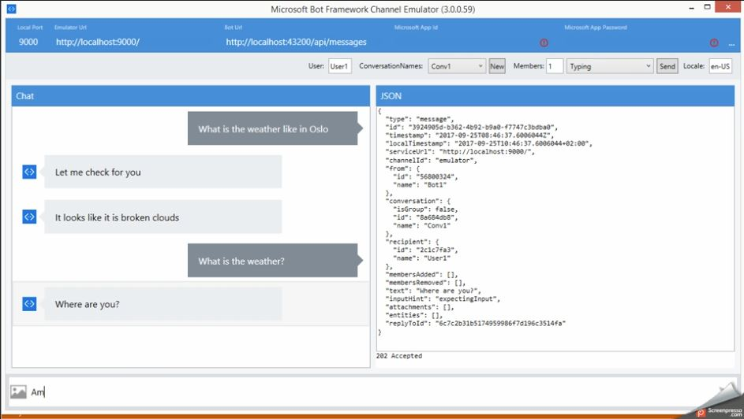

# Chatbot tutorial

This tutorial covers how to make a chatbot using the Unit4 Bot Builder and LUIS.

## Content
-  U4.Bot.Builder nugets. The packages are available on the Unit4 People Platform Dev Feed [http://packages.u4pp.com/nuget-dev/nuget](http://packages.u4pp.com/nuget-dev/nuget)
-  IAgent and LuisDialog classes
-  [Microsoft Bot Emulator](https://emulator.botframework.com/ "Bot Emulator") for running the chatbot
-  [LUIS (Language Understanding Intelligent Service)](https://www.luis.ai/ "Language Understanding Intelligent Service") Intents and Entities

## Tutorial video

> Parts of the tutorial video might be considered outdated, although the basic principles are valid. Any external applications and websites used are subject to change.

## Sample code

Download the sample code from [Sample chatbot zip](files/SampleChatBot.zip "Sample solution").
