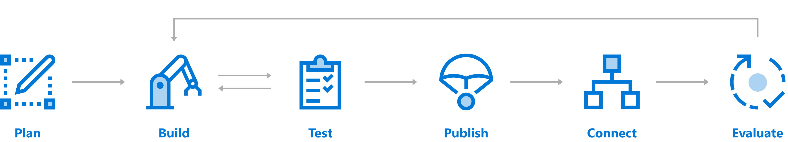

# Chatbot deployment overview

This section provides an overview of the Wanda chatbot deployment process. 

## Register and deploy a chatbot

A chatbot must be registered and deployed to the Wanda ecosystem to be made available for users. The infrastructure requires chatbots to be made available as a component that can be hosted in a web application. This component could be a web job or a web application that will start your chatbot using `MessageService.Setup<Chatbot>()`. 
The chatbot's main LUIS intents must also be made available to Wanda, so that it can be merged into the main LUIS model for Wanda. 

## Chatbot registration

Wanda maintains a list of known chatbots in the ecosystem and the chatbots must be added to this list to be included in Wanda's runtime. This is a manual step and will be done by the Unit4 People Platform DevOps. 

## Chatbot deployment and hosting

The chatbot is simply a service that listens to messages on a service bus, therefore the chatbot could run on any infrastructure as long as it can listen to the service bus and is connected to the internet.

If you want to have a more integrated development and release pipeline, you can do so by using the Unit4 People Platform development pipeline and hosting infrastructure.

## Unit4 People Platform pipeline

> This is a brief outline of the pipeline, please contact the Unit4 People Platform if you want to integrate into this pipeline.

This pipeline relies on VSTS (Visual Studio Team Services) for source control and continuous integration. The chatbot code lives in a Git repository that has continuous integration (CI). The chatbot is released to our Azure infrastructure using ARM templates and release definitions in VSTS. A chatbot will be continuously deployed (CD) to the digital assistant development infrastructure after a successful build from the development (master) branch.

A chatbot is released to the production environment by merging the master branch to a dedicated branch (release). From this branch you deploy the chatbot into the production infrastructure in Azure.

In the U4PP pipeline, the chatbot's LUIS application is maintained centrally in a dedicated LUIS subscription. A process to import LUIS applications into this subscription exists.

If you are not familiar with Visual Studio Team Services, see the [official documentation](https://www.visualstudio.com/team-services/).

