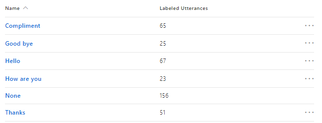

# Dialogs

> This topic applies to v3 of the U4.Bot.Builder. 

[Dialogs](https://docs.microsoft.com/en-us/azure/bot-service/dotnet/bot-builder-dotnet-dialogs?view=azure-bot-service-3.0) model a conversational process, where the exchange of messages between the bot and user is the primary channel for interaction. Dialogs can be composed of other dialogs to maximize reuse, and a dialog context maintains a stack of dialogs active in the conversation. 

## IDialog&lt;T>
Dialogs implement `IDialog<T>`, where *T* is the is the return value of the dialog. Dialogs are all `Serializable` so that their complete conversation can be stacked and persisted through the Messages sent to and from the underlying Bot connector.

```csharp
[Serializable]
public class EchoDialog : IDialog<IMessageActivity>
{
    public async Task StartAsync(IDialogContext context)
    {
        context.Wait(MessageReceivedAsync);
    }
    public async Task MessageReceivedAsync(IDialogContext context, IAwaitable<IMessageActivity> argument)
    {
        var message = await argument;
        await context.PostAsync("You said: " + message.Text);
        context.Wait(MessageReceivedAsync);
    }
}
```
### IDialogContext
The `IDialogContext` represents the current state of the conversation. When a context object has `Wait` called on it, that method is added to the stack of callback functions to execute and afterwards when a new message is received, it's passed to the callback as shown by the EchoDialog example above. The method `MessageReceivedAsync` is continuously added and removed from the stack of callback functions and it's not possible to break this cycle.

Wanda relies upon multiple agents working together in unison. When a chatbot receives control from Wanda, the chatbot may or may not pass control back to Wanda directly. The EchoDialog example above is a good example of a dialog that will not work well with Wanda as it never passes control back. Typically, a chatbots does not pass control back to Wanda directly and instead it starts a conversational flow, asking about different things. 

To avoid ending up in a deadlock situation, such as with the EchoDialog example, the chatbot must break this cycle and release control to Wanda. 

#### IDialogContext.Complete
`IDialogContext.Complete` is used by the dialog initiated by the chatbot. When `Complete` is called, the chatbot is done and returns control to Wanda.

#### IDialogContext.Done
`IDialogContext.Done` is used by internal dialogs initiated by parent dialogs. When `Done` is called, the internal dialog is done and returns control to the parent dialog.


## Microsoft.Bot.Builder.Dialogs.LuisDialog&lt;T&gt;
The Microsoft Bot Framework comes ready with a `LuisDialog<T>`. A dialog of this type should contain conversation entry point methods (IntentHandlers) tagged with `LuisIntent`, and each `LuisIntent` name should match a corresponding [LUIS](luis.md) intent within the connected LUIS application. With this structure established properly, initial user input will be correctly classified in LUIS and then automatially routed to the corresponding entry point method of the dialog.

Assuming that the connected LUIS application holds the following intents: 


A `LuisDialog` connected with this LUIS application could be implemented as follows:

```csharp
[Serializable]
[LuisModelFromConfig("salutation:luis-model-key", "salutation:luis-subscription-key", "salutation:luis-region-key")]
public class SalutationDialog : LuisDialog<IMessageActivity>

	[LuisIntent("Hello")]
	public async Task HelloAsync(IDialogContext context, LuisResult result)
	{
		await context.Complete("Hello, what can I help you with?");
	}

	[LuisIntent("How are you")]
	public async Task HowAreYouAsync(IDialogContext context, LuisResult result)
	{
		await context.Complete("I'm fine thanks. How are you?");
	}

	[LuisIntent("Goodbye")]
	public async Task GoodbyeAsync(IDialogContext context, LuisResult result)
	{
		await context.Complete("Good bye. It was nice talking to you.");
	}

	...

	//Required for the None intent (catch all)
	[LuisIntent("")]
	public async Task CatchAllAsync(IDialogContext context, LuisResult result)
	{
		await context.Complete($"You said: {result.Query}");
	}
}
```

### LuisModelFromConfigAttribute - custom LuisModelAttribute
In the example above, the `SalutationDialog` is tagged with the attribute `LuisModelFromConfig`. This attribute ships with `U4.Bot.Builder`, and is a custom implementation of a `Microsoft.Bot.Builder.Luis.LuisModel` reading LUIS connection strings from application settings:

```xml
    <appSettings>
      <add key="salutation:luis-model-key" value="[luis application id]" />
      <add key="salutation:luis-subscription-key" value="[luis subscription key]" />
      <add key="salutation:luis-region-key" value="westus" />
    </appSettings>
```
With this attribute set, the dialog will connect to the LUIS application defined by application settings.

### LuisResult
The result of the interaction with a LUIS endpoint is returned as a `LuisResult`. This object holds the identified LUIS Intents and Entities as well as the actual message/query received from the user.

IntentHandler methods can also have an additional IAwaitable\<IMessageActivity\> parameter if properties of the original message are needed to process the LuisResult.
> Note: The current user message can always be obtained from IDialogContext.Activity
```csharp
[LuisIntent("Goodbye")]
public async Task GoodbyeAsync(IDialogContext context, IAwaitable<IMessageActivity> message, LuisResult luisResult)
{
	// Work with the luisResult...
}
```

## U4.Bot.Builder.Dialogs.CachingLuisDialog&lt;T&gt;
To improve performance the The U4.Bot.Builder framework provides an implementation of LuisDialog that uses CachingLuisServices to cache LuisResults for a configurable amount of time.
LuisModelAttribute and derived attributes can be used to specify the AppId and EndpointKey of the Luis app(s).
The cache expiration time can be specified in minutes either in the config settings of each chatbot individually (key "LuisCacheExpiration") or centrally in the IConversationContext.LuisConfiguration.CacheExpiration.
Caching can be disabled by setting the expiration time to zero.
```csharp
[Serializable]
[LuisModelFromConfig("luis-model-key", "luis-subscription-key", "luis-region-key")]
internal class ExampleLuisDialog : CachingLuisDialog<IMessageActivity>
{
	//Required constructor for FluentTests
    public ExampleLuisDialog(ILuisService luisService) : base(luisService)
    {
    }

	//Required constructor - services defined through IoC
    public ExampleLuisDialog(LuisServiceFactory luisServiceFactory) : base(luisServiceFactory)
    {
    }

    [LuisIntent("")]
    public async Task NoneHandler(IDialogContext context, LuisResult result)
    {
		await context.Complete($"You said: {result.Query}");
    }
}
```

## U4.Bot.Builder.Dialogs.ResolvingLuisDialog&lt;T&gt;
`U4.Bot.Builder.ResolvingLuisDialog<T>` extends `CachingLuisDialog<T>` and relies upon the main LUIS configuration delivered with the [conversation context](conversation-context.md) of the current conversation. 
The "global" LUIS configuration points to the main Wanda LUIS subscription. This subscription contains multiple LUIS applications and to ensure that an instance of a `ResolvingLuisDialog` runs againts correct LUIS application, it must be tagged with the `LuisApplicationName` attribute.

> The `IConversationContext` is accessible within your dialog through the `IDialogContext.GetConversationContext()` extension method.  

The following code example shows the same Salution dialog as before, but now as an instance of a `ResolvingLuisDialog`:

```csharp
[LuisApplicationName("Salutation")]
[Serializable]
public class SalutationDialog : ResolvingLuisDialog<IMessageActivity>
{
	//Required constructor - services defined through IoC
	public SalutationDialog(LuisServiceFactory luisServiceFactory, ILuisSubscriptionResolutionService luisSubscriptionResolutionService, ILuisServiceCreator luisServiceCreator)
		: base(typeof(SalutationDialog), luisServiceFactory, luisSubscriptionResolutionService, luisServiceCreator)
	{}

	//Required constructor for FluentTests
	public SalutationDialog(params ILuisService[] services)
		: base(services)
	{}

	[LuisIntent("Hello")]
	public async Task HelloAsync(IDialogContext context, LuisResult result)
	{
		await context.Complete("Hello, what can I help you with?");
	}

	...
}
```
> If the LUIS application resides within the connected Wanda subscription, the `LuisDialog` should be of type `ResolvingLuisDialog`.

### Developing with ResolvingLuisDialog&lt;T&gt;
As described earlier, the `ResolvingLuisDialog<T>`connects to the LUIS subscription provided with the dialog conversation context. However, if the LUIS application defined with the attribute `LuisApplicationName`is not found within this subscription, then it's possible to fallback to application settings:

```xml
<appSettings>
	... 
	<add key="SalutationDialog-ModelId" value="[luis application id]" />
	<add key="SalutationDialog-SubscriptionKey" value="[luis subscription key]" />
	... 
</appSettings>
```
This is suitable during development if creating a new LUIS application within a separate LUIS subscription.
