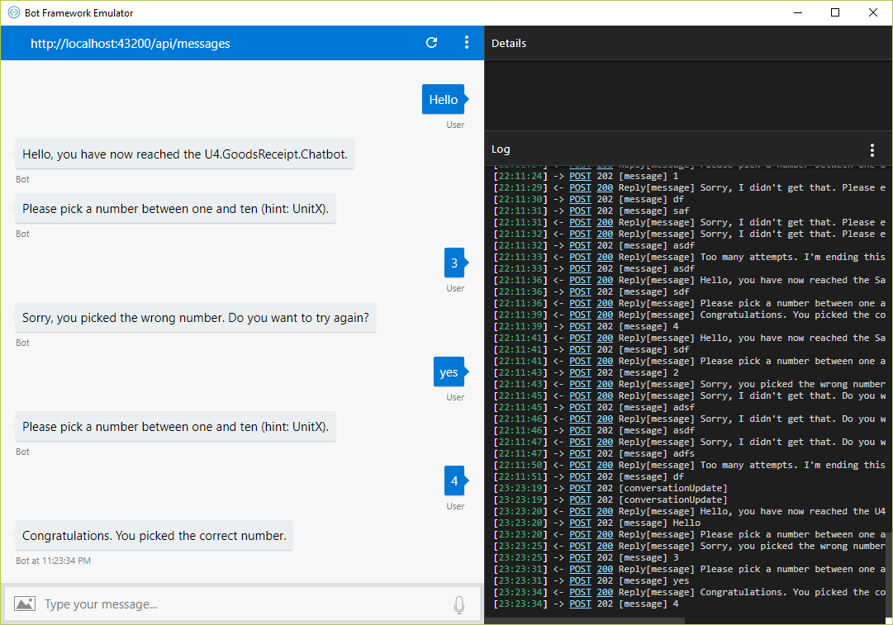
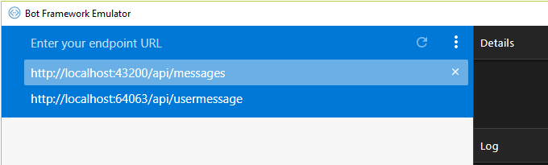

# Microsoft Bot Framework Emulator

> This topic applies to v3 of the U4.Bot.Builder. 

The Microsoft Bot Framework provides a chat emulator that makes it possible to quickly test Wanda chatbots as if they were called through the actual Wanda service.



With the emulator, it's possible to:
* Send requests and receive responses to and from the chatbot
* Inspect the JSON response
* Emulate a specific user and/or conversation

For more information see the [Microsof Bot Service Documentation](https://docs.microsoft.com/en-us/azure/bot-service/bot-service-debug-emulator?view=azure-bot-service-3.0).

> **Note:** Parts of the Microsoft documentation is not applicable for Unit4 chatbot development. It refers to emulator version (v4) that has not been tested with the Unit4 Bot Framework.

## Installation and configuration
Go to [https://github.com/Microsoft/BotFramework-Emulator/releases](https://github.com/Microsoft/BotFramework-Emulator/releases) to get the latest version of the emulator. Download and install the emulator locally. It is recommended to use the v3 version of the emulator.


## Using the Emulator with chatbot development
The [Unit4 Bot Framework Visual Studio Project Template](chatbot-template.md) comes ready with a dedicated emulator console application project that will host and expose the template chatbot over HTTP.

An alternative to this approach is to create a new console application project in the current chatbot solution, and refer the nuget package `U4.Bot.Builder.Test`. Next, create an `EmulatorAgent` class that inherits the actual chatbot `Agent` and override the IoC container of that class. Use the extension method `UseEmulator` on the container builder of the IoC container. This ensures that core `U4.Bot.Builder` services are adjusted for usage with the emulator.

```csharp
public class EmulatorAgent : MyAgent
{
	private static readonly IContainer _container;
	protected override IContainer Container => _container;

	static EmulatorAgent()
	{
		//Get the container builder from the Chatbot IocConfiguration class.
		ContainerBuilder builder = IocConfiguration.GetContainerBuilder();

		//Ensure that core Ioc services can run with the emulator.
		builder.UseEmulator();

		_container = builder.Build();
	}
}
```
To start hosting the chatbot over HTTP for the emulator, run `Emulation.Emulator.Start<EmulatorAgent>`, and include a valid conversation context:
```csharp
class Program
{
	static void Main()
	{
		var conversationContext = new ConversationContext
		{
			//The identity of the user running the chatbot
			Identity = new ConversationIdentity
			{
				FullName = "John Doe",
				UserId = "Average Joe",

				AccessToken = "", //Ids Access token identifying the user.
				Authority = "", //Ids Authority used to authorize and grant access.
				TenantId = "" //The current tenant
			},

			//Setup the core Luis configuration used by services defined
			//in U4.Bot.Builder and this chatbot.
			LuisConfiguration = new LuisConfiguration
			{
				CacheExpiration = 0,
				SubscriptionKey = "",
				EndpointKey = ""
			},
		};

		Bot.Builder.Test.Emulation.Emulator.Start<EmulatorAgent>(conversationContext);
	}
}
```

> **Note:** The LuisConfiguration property of the [`ConversationContext`](conversation-context.md) is required to resolve `LuisDialog` intents, and is also essential for core services such as the `U4.Bot.Builder.Interfaces.IAffirmationService`.

When running `Emulation.Emulator.Start<EmulatorAgent>` it's possible to include a dedicated hosting URL. If no URL is provided, the chatbot will by default be hosted at **http://localhost:43200/api/messages**. The Microsoft Bot Framework Emulator can now communicate with the chatbot by assigning the emulator endpoint URL to the URL of choice:

