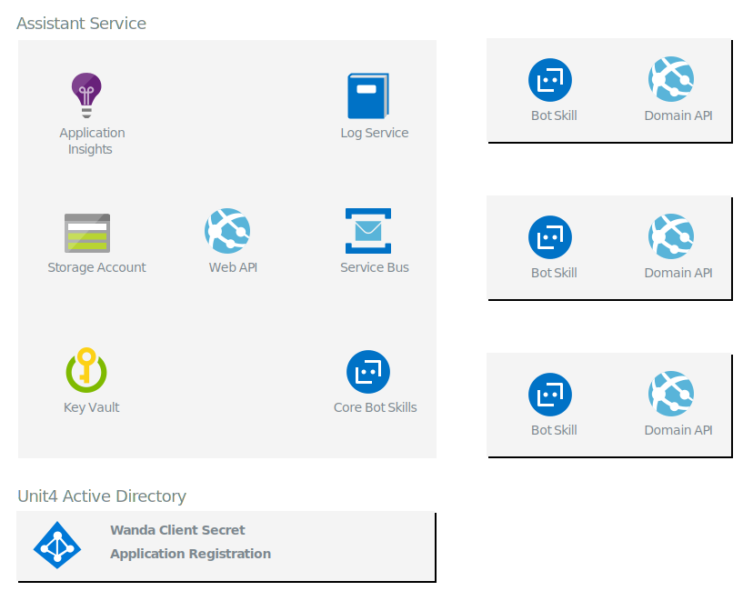

# Architecture overview

This guide provides an overview of Wanda's architecture. 
It covers the basic services used in the infrastcuture and how they operate together to provide the digital assistant experience. Further diagrams and guides broaden the view, and provide more details about advanced topics.

The Wanda digital assistant is a web application service with a web API. All communication to Wanda goes through the Web API exposed by the assistant service.
The assistant service functions as a proxy that forwards messages to the specific chatbot skills based on the classification of the users utterance. The communication to the chatbot uses a service bus infrastucture.
The chatbot skills are deployed as long running Azure webjobs that listen to specific topics on the messaging infrastucture. The main purpose of the chatbot is to implement conversational flows for specific functional areas. 

The business logic is not implemented in the chatbot but in a companion Web API, refered to as the Domain API or Functional Aggregator. Multiple chatbots can consume the same domain API. For example, there are specific chatbots to register absence and get balances. 
These chatbots are deployed as separate web jobs but rely on the same domain API (Human Resources). The Domain API will in most cases call web APIs in the ERP source system for instance Unit4 Business World Public Web API.

The infrastucture uses a storage account as the repository. The data stored in the tables is not covered in this guide. 

