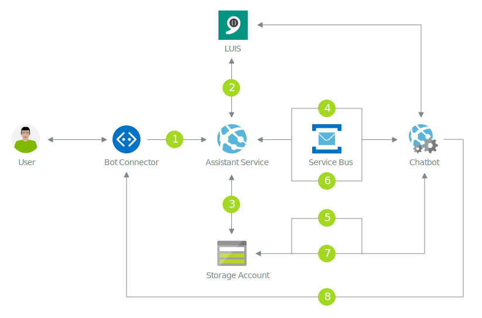

# Bot messages flow

The previous guides showed a simplified view of the Wanda ecosystem, and explained how Wanda is made available as a bot using the Bot Channel Registration. 
In this guide we use that knowledge of the infrastucture to understand how data flows through the system.

## 1. Message to bot
Whenever a user sends a message to Wanda, the message is processed through the Microsoft Bot Connector. It is then passed to the configured message endpoint of the bot.
The assistant service receives the message and processes it further. 

All users interacting with Wanda need to establish their identity. This is done through a dialog flow that involves asking the user what company he/she works for, and then authenticating using the company's (tenant's) Unit4 Identity Services.
This phase involves the Unit4 Discovery Service and a Unit4 Identity Services instance. When the identity is established it is stored in the Unit4 Identity Mapper.

When the user identity is established the next step is to classify the user's intent.

## 2. LUIS main intent classification

The ecosystem consists of a set of bot skills, for example the ability to register an absence or expense etc.
Whenever a user is not engaging in an active conversation with a particular skill, the assistant service classifies utterances using the main LUIS application. If the main LUIS recognizes that an utterance belongs to a known skill intent, a conversation with the relevant chatbot is established.
All consecutive messages from the user are sent to that specific chatbot until the conversation is completed. Completion of a conversation can occure when:

- the chatbot conversation flow is completed
- there is an exception during the conversation flow
- the user abandons the conversation using reserved words
- the conversation times out (by default 20 minutes)

## 3. Conversation stack
Whenever a user message has been classified and mapped to a chatbot. A conversation is established and given a unique identifier. This is then stored in the storage account and refered to as the user's conversation stack.
A user can have multiple conversations in the stack, but only one active conversation. A conversation is sticky until the conversation is marked as completed or abandoned.

## 4. Message delegation

Each messages received through the Microsoft Bot Connector is a normalized representation of a message/activity from any of the supported channels. 
Whenever these messages are forwarded to a chatbot it is extended with a set of configurations and formalized as an object recognized by any chatbot in the ecosystem.
The message is then put on the internal messaging infrastucture (service bus) in a specific queue for the associated chatbot. The chatbot will listen to the specific queue and pick the message for further processing.

## 5. Get dialog stack
All chatbots in the ecosystem are implemented using the U4.Bot.Builder framework. This framework is built on top of the Microsoft Bot Builder. For further details see the development guides.
Whenever a conversation with a chatbot is active, the state of the dialog flow is stored in the central storage account. This state is refered to as the dialog stack. This means whenever a chatbot picks up a message from the service bus, it will attempt to rehydrate the dialog stack and continue execution.

## 6. Notify assistant service about conversation state

The chatbot will process the user message, and prepare the response returned to the user. As part of this, it will notify the assistant service about the conversation status, if whether it is still in progress or should if it be marked as completed.
The conversation stack will be updated accordingly in the storage account.

## 7. Store dialog stack
The current dialog stack will be stored in the storage account.

## 8. Message to user
The chatbot will send the message to the user using the Microsoft Bot Connector.

