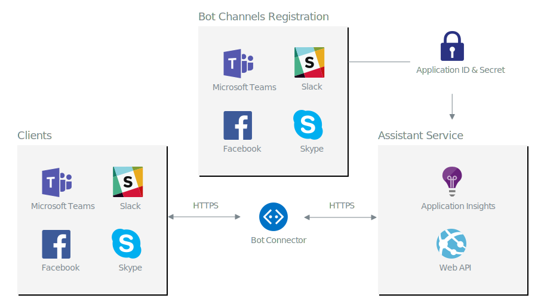
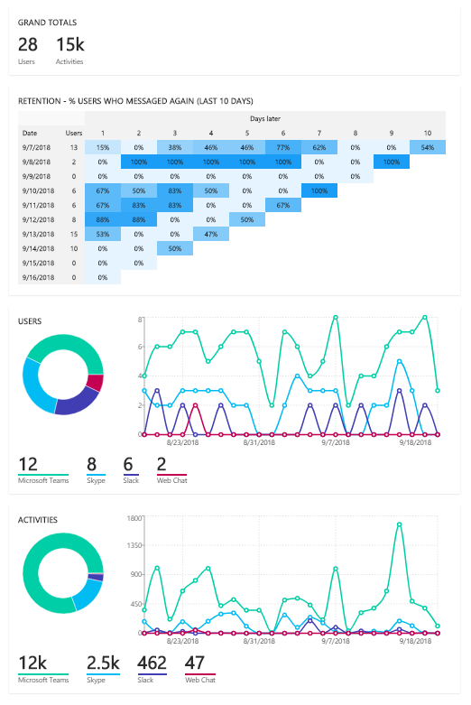

# Bot channel registration

Wanda is exposed as a bot through Microsofts Bot services. As described, the digital assistant is just an web application with a web api. 
The bot channel registration resource is where you connect the bot to channels. In this resource you will also obtain the application ID and secret used for authentication.
These values are configured in the assistant service web application, and are used to authenticate any messages sent to the bot message web api of the assistant service.

## Application insights
Through the bot channel registration you connect the bot service to application insights. The bot service will send specific telemetry data to configure application insights. This way you can monitor and analyze usage with the properties provided in the telemetry, for example channelId.
The most useful telemetry data sent to the application insights is the **Activity** custom event.

## Analytics

The bot channel registration also provide a spezialied view to analyse usage of the bot. 

For more details on this topic go to the [official bot service documentation](https://docs.microsoft.com/en-us/azure/bot-service/bot-service-manage-analytics?view=azure-bot-service-3.0).

