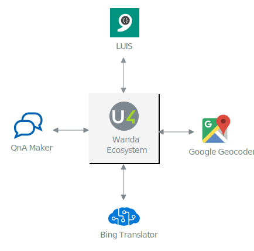

# Service dependencies

This guide explains the services used by the Wanda ecosystem that are maintained outside of the Azure portal.

## LUIS

The Language Understanding Intelligent Service (LUIS) is the service used by the Wanda ecosystem to classify message sent to the bot. 
This means understading the users intent and extracting entities from the utterances. 
The ecosystem relies on a series of language models (apps) maintained through the LUIS AI web site (https://eu.luis.ai/).

> Wanda uses the European regional website and service.

### Keys
To use LUIS from the bot, a Language Understanding Service must be created in Azure. Through this, cognitive service keys are obtained to call LUIS from the ecosystem.
These keys must be configured with the Wanda ecosystem. For further details see the operation guides.

## QnA Maker

To provide an extensible conversational experience Wanda relies on the QnA Maker Service to provide the logic to answer common questions.
As with LUIS, the QnA maker relies on cognitive service resources deployed into Azure. 
This resource consists of several services that are used by Microsoft to classify and answer user questions. 

The knowledge bases are created and maintained using [https://www.qnamaker.ai/](https://www.qnamaker.ai/).

### Keys

Endpoint keys for the knowledge bases are obtained via the qnamaker.ai portal. The subscription key is obtained via the cognitive resource in Azure.

For Wanda the following subscription and endpoint keys are required:

- Standard Help QnA
- Fallback QnA

## Bing translation

Wanda's ability to understand and repond in multiple languages relies on the use of Bing Translation. A cognitive service of Translator Text must be created in the Azure subscription.
Through the resource you obtain an API key that's used to configure the ecosystem. The cognitive service resource is used for billing.

## Google GeoCode

Certain services in the ecosystem use Google APIs to resolve geocoding. A Google account with geocode enabled must be created, and services must be configured with the API key.

Services using Google geocode:

- Travel request chatbot
- Expenses chatbot

