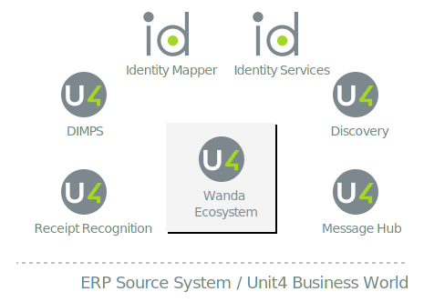

# The Wanda ecosystem

The Wanda ecosystem is a set of services that work together to provide the conversational AI experience. 
The main parts of Wanda are the core digital assistant and the chatbots. The core digital assistant (refered to as the Assistant service) is responsible for receiving messages from users through the Microsoft Bot Framework, managing user identities and the conversations, and directing traffic to the available chatbots.
The chatbots provide the various skills, such as the ability to register absences, timesheets, expenses, as well as submit simple purchase requisitions etc.

The Assistant service has a Web API that is registered with the Microsoft Bot Framework. Any messages from users on the supported social media channels will go to the digital assistant API.
This API will relay messages to the chatbots using a message-based system. The chatbots are long running WebJobs that listen to messages on the message bus infrastructure.

The Wanda ecosystem relies on these other Unit4 People Platform services:

* [Unit4 Indentity Services](https://thehub.unit4.com/docs/identity-services/Latest/.%2Fdocs%2Findex.md)
* [Unit4 Discovery Service](https://thehub.unit4.com/docs/discovery-service/Latest/docs%2Findex.md)
* [Unit4 Identity Mapper](https://thehub.unit4.com/docs/identity-mapper/Latest/docs%2Findex.md)
* [Unit4 Message Hub](https://thehub.unit4.com/docs/message-hub/Latest/docs%2Findex.md)
* [Unit4 Receipt Recognition Service](https://thehub.unit4.com/docs/receipt-recognition/Latest/docs%2Findex.md)
* Unit4 DIMPS (self-driving accounting)

The chatbots rely on other business APIs to drive the conversational UI.
