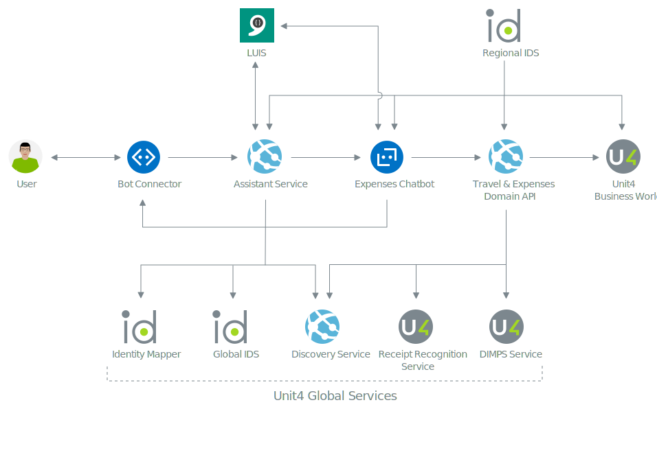

# End to end

The previous guide discussed from a technical perspective how a message from the user flows through the system to the bot. This guide will draw on this and explain what services are involved in a full conversation with Wanda.
The guide will use the expenses chatbot as an example, because it depend on most of the services previously discussed and will help give a full understanding of Wanda's architecture. The content of this guide will not focus on single messages passed from user to bot, but rather look at the ecosystem from a full conversation perspective.
The details of the conversation itself are not important.
 

All communication between the user and the bot is through the Microsoft bot connector. The assistant service uses the Unit4 Identity Mapper to maintain the mapping between corporate and channel user. The corporate identity is resolved by user authentication with the tenants regional IDS. 
The Unit4 Identity Mapper is also responsible for storing and securing the refresh token obtained in the authentication process. The refresh token is used so that users do not have to reauthenticate when the access token expires. This token is passed to any chatbot in the ecosystem, and is used to call downstream web APIs.
The address of a tenants IDS (the regional IDS assigned to the tenant) is resolved using the Unit4 Discovery Service. 

The state of a conversation and the chatbot dialog are kept in the storage account. The dialog stack is rehydrated on any message from the user, as long as there is an active conversation with the chatbot.
All messages from and through the bot go via the Microsoft Bot Connector. Internally in the Wanda ecosystem, a messaging infrastucture is used to delegate a message from the assistant service to the chatbot.

The chatbot maintains the dialog stack in the storage account, and the expenses chatbot, for example, depends on a set of services to provide the conversation AI.

The expenses chatbot will call the Travel and Expenses domain api over https to process business logic. 
The domain API acts as a multitenant gateway to any source system. The motivation of this service is to normalize and aggregate data obtained by the ERP source system. In the case of this domain API, the only supported ERP source system is U4BW.

The domain API is secured by a set of IDSes, and will perform proper token validation based on the issuer claim in the JWT token passed to the API. This means that any consumers of the domain API has to obtain a valid token. In this scenario, the expenses chatbot will do a user impersonation token request to the regional IDS to obtain a token. The token is then used to call the domain API.
Any tokens obtained from the IDS that involve a user will include the Unit4 ecosystem standard claims **unit4_id** and **tenant**. Its important to understand this aspect; the tenant claim will be used to call the discovery service to resolve service descriptions (urls).

The domain API has to resolve the corresponding ERP source system for any requests. This process involves using the tenant identifier transported in the token. This tenant id is used when the domain API query the Unit4 Discovery Service for the U4BW source systems Web API uri.
When the domain API calls downstream to the ERP Web API it will again do a user impersonation token request to get a proper token to call the U4BW source system. That token must include the **u4bw** resource scope. You can read more about IDS user impersonation [here](https://thehub.unit4.com/docs/identity-services/Latest/.:docs:internal:tutorial-user-impersonation-flow.md).

> All logic to obtain tokens from the tenants IDS depends on a set of predefined clients and scopes. This is discussed in detail in the [Identity Services operations guide](identity-services.md).

The result of the request (can be multiple) from the ERP source system will be normalized. This implies that requests to the domain API can spawn multiple requests, and results of these requests are aggregated. 
The travel and expenses domain API will use the Unit4 Dimps service to collect and determine accounting matrices when doing expenses. The domain API also provides the ability to extract expense values using receipt recognition. The receipt recognition capabilities are provided by the Unit4 Receipt Recognition Service (U4RRS).

The result of the Domain API call is used to construct a message that is sent to the user via the Microsoft Bot Connector.

