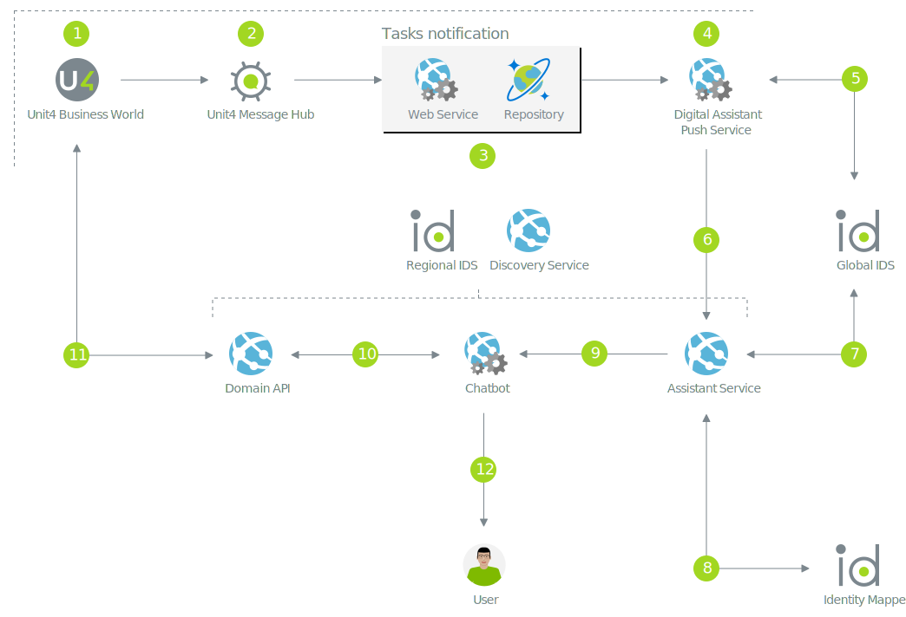

# Notifications

An integral part of the Wanda ecosystem is to initiate proactive conversations with users. Proactive conversations are those conversations initated by the bot. With Wanda, the ability to send notifications to users depends on a group of services working together.
The source of the notifications in Wanda is either a tenant's source system (Unit4 Business World) or through Unit4 Extensions Kit. We will focus on the proactive notifications driven by U4BW in this guide.

All services discussed so far with some exceptions (regional IDS) are considered to be global services in the Unit4 cloud offering. But the infrastucture needed for proactive conversations is partly regional.
This means that a group of services lives in a specific region. 

## 1. U4BW Messaging
The ability for a U4BW instance to communicate to the outside world depends a Unit4 Message Hub infrastucture. This communication is centered around changes to data in the source system. 
Those messages can be picked up by other services in the Unit4 sphere. Details on the setup in U4BW are found elsewhere. The important thing is that the U4BW messaging is setup to send messages on a regional Unit4 Message Hub.

## 2. Unit4 Message Hub
For any U4BW instance to publish messages on the regional messaging infratucture a Message Hub client must be configured. 
A client that is used to relay messages to the tasks notification service is also required.

## 3. Tasks notifications service
Based on the setup in the MessageHub instance, the tasks notification service will listen to messages and pick up those that are relevant for further processing.
Those messages contain objects that are most likely related to workflow in the U4BW source system. 

The tasks notfification service will place the objects in a repository (Cosmos DB). A scheduled service will pick messages and publish a new event on the Message Hub Infrastucture.
The Digital assistant push service is configured to receive those messages.

## 4. Digital Assistant Push Service
The digital assistant push service lives in the regional infrastucture and is the bridge to Wanda's global infrastucture. 
The main task of the push service is to relay messages to the notifications endpoint of the assistant service web API. 

## 5. Obtain token from global IDS
This communication is secured by the global IDS, using client credentials.
The push service will listen to messages on the regional messaging infrastucture and forward those as web requests to Wanda's notifications endpoint.

## 6. Wanda notifications
Wanda's notification endpoint will process any notification requests. For more details on the form of the notification nmessages see the [proactive conversations guide](../proactive-conversations.md). A notification must carry the unique identifier from the recepient user (unit4 ID and tenant ID) 
and additional information about how the notification should be processed. Most notifications that originate from U4BW are handled specifically in the chatbot. The notification will specify which chatbot should receive this notification, and it will carry additional data that will be processed by the chatbot.

## 7. Obtain token from global IDS
The assistant service needs to obtain a token from the global IDS to call the Unit4 Identity Mapper API.

## 8. Identity Mapping
The notification concept relies on reverse-mapping the unique corporate user to the identifier on the social channel. Mapping from unit4 ID and tenant ID to channel identifier relies on the Unit4 Identity Mapper.

## 9. Assistant Service notification handling

If the notification enpoint receives a notification for a user that is not known to Wanda, the situation will be logged, and the consumer (calling service) will be informed using standard http status code and messages.
If the user is known, the assistant service will resolve the last used channel for that user, and use that as the primary channel for proactive conversations. The notification data sent to the webapi are used to determine which chatbot is to receive the notification. A message is the constructed and sent on the tenant's messaging queue.

> Notifications can also be sent directly to the user without further processing in the pipeline.

## 10. Chatbot notification handling

The chatbot that supports notification scenarios will have specific code for handeling this. When it receives the notification message on the service bus, it will do further processing and use the bot connector to initiate conversation with the user.
The processing of the notification might involve calling the U4BW web API through a domain API.

## 11. Domain API and tenant specific U4BW
If the chatbot requires more data to process the notification it will call the tenant's source system through the specific domain API (functional aggregator Web API). Ths step involves obtaining user impersonation tokens from the tenant IDS and resolving the U4BW service uri from the global discovery service.

## 12. Proactive message to user
The data returned from the domain API is used to formulate the proactive messages to the user. A proactive message to the user is sent using the Microsoft Bot Connector API. The unique channel user ID and channel ID is used. 

