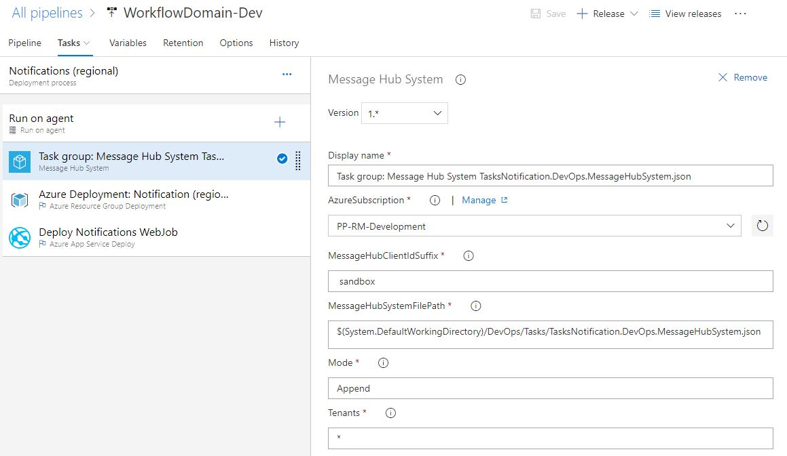
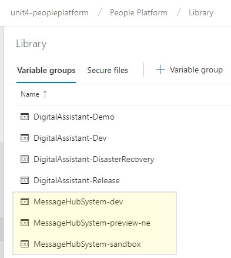
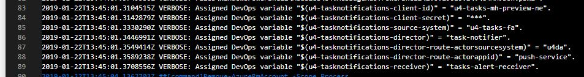
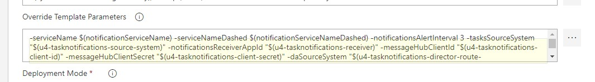

# Tasks pipelines

## Build definition

https://unit4-peopleplatform.visualstudio.com/People%20Platform/People%20Platform%20Team/_apps/hub/ms.vss-ciworkflow.build-ci-hub?_a=edit-build-definition&id=370

## Release definition

https://unit4-peopleplatform.visualstudio.com/People%20Platform/_apps/hub/ms.vss-releaseManagement-web.cd-workflow-hub?definitionId=226&_a=environments-editor-preview

> Unit4 Tasks portal has its own release definition.

## Tasks notifications service - Message Hub provisioning

As described in the architecture guides, the tasks notifications service must be deployed into a regional infrastucture. That infrastucture has to have corresponding Unit4 People Platform services like Unit4 MessageHub.
See the [notifications architecture](notifications.md) for details.

> Configuration in the associated Unit4 Message Hub is required. Message Hub configuration must be reflected in the application settings section of the service.

### Self provisioning by release pipeline
Task Notifications release pipelines utilize Azure DevOps Task Group **Message Hub System** to provision for Identity Services clients and Message Hub source systems. This system is designed to be self-contained automatically updating all required Message Hub related settings when required to.



Task Group input parameter **MessageHubSystemFilePath** points to JSON definition **TasksNotification.DevOps.MessageHubSystem.json**. This definition contains the setup required for the Task Notifications service to listen in on events raised by Unit4 Business World through Message Hub. The JSON also holds the setup needed for directing Message Hub events further on to the Unit4 Push Service, which in turn communicates with the Wanda Assistant Service.

#### DevOps Variable Group MessageHubSystem-[MHInstance]

The task group relies upon DevOps Variable Group **MessageHubSystem-[MHInstance]** to determine which Message Hub and Identity Services instance to communicate with. 



There should be one variable group per deployed Message Hub instance, and it is vital that the referred variable group fits with the current Azure subscription.

|Subscription|Variable groups
|--|--|
|PP-RM-Development|MessageHubSystem-sandbox<br>MessgeHubSystem-dev
|PP-RM-Production|MessageHubSystem-preview-ne

> **Note:** This is vital because the Message Hub System task group must be allowed create new Message Hub Source systems. To provision for this, the system needs to add a new Identity Services client with the proper Message Hub rights set, and creating this client requires Identity Services administrator rights. Credentials for an administrator client can be found in the global People Platform key vault within the current Azure subscription. Hence, it is vital that the referred variable group fits with the current Azure subscription so that the system can connect to the correct Identity Services- and Message Hub instance.

#### DevOps variables
The Message Hub System can create Azure DevOps variables based on statemenents in the provided JSON definition. The following JSON object shows the definition of Message Hub client *u4-tasks-mh*. Credentials for this client will be available as Azure DevOps variables named *u4-tasknotifications-client-id* and *u4-tasknotifications-client-secret*. Similar notation is available for Message Hub Source systems and the internals of these.

```json
"MessageHubClients": [
  {
    "DevOpsName": "u4-tasknotifications",
    "Id": "u4-tasks-mh",
    "Name": "U4 Task Notifications Client",
    "Roles": [
      "Receive",
      "Direct"
    ],
    "Actors": [
	  "*"
    ],
    "SourceSystems": [
      "u4da-tasks"
    ],
    "Tenants": [
      "*"
    ]
  }
]
```

The following screenshot shows the log from a release of the task notifications system. As seen, multiple DevOps variables have been created by the Message Hub system task group.



These variables are further set as input to the next DevOps deployment task, ensuring that required ARM template parameters related to the Message Hub setup are assigned properly.

