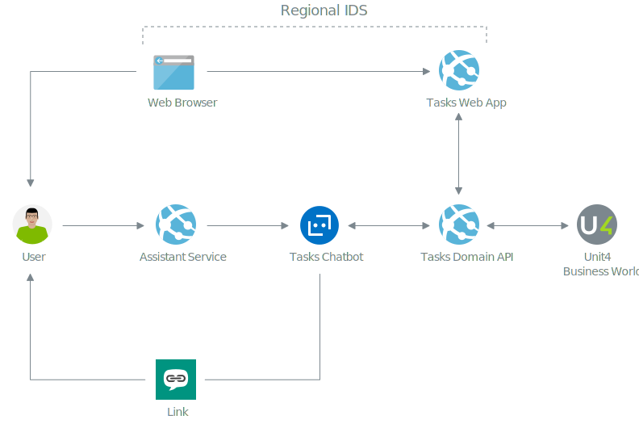

# Tasks application

The previous guide explained how notifications in Wanda can be driven by changes in the ERP source system (U4BW). One of Wanda's core features is the ability to follow up tasks that a user has in Unit4 Business World. These can either surface through notifications in Wanda, or when the user asks Wanda task-related questions.
Due to the limitation of the conversational AI, a companion applcation has been implemented to give the user a better experience when working with multiple tasks.

The Tasks application is integrated in the conversational flow by adding links in the dialog when appropriate. Users can then go to the Tasks web app to complete the task(s).

The Tasks Web Application is a global service that supports all the known regional IDS in the Unit4 cloud offering.

