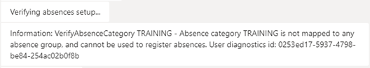

# User diagnostics

Wanda offers a diagnostics tool to verify that the Wanda setup in Unit4 Business World is correct for the current user.

## Running the diagnostics tool

The diagnostics tool is run by simply entering `#diagnostics` in the user's chat channel.
Wanda then runs through each functional area for the user's tenant and provides a report describing any issues. The most common issues are related to users not having access to public web APIs and SOAP in their backend system.
The required setup is described in the [Wanda implementation guide for Business World](https://wanda-implementation-guide.u4pp.com/).

## User diagnostic ID
Any issues related to a user are reported in the chat and given a User diagnostics ID, for example:

To get further details on the issues the Application Insights log must be cross-referenced by searching/filtering using the unique user diagnostics id (userDiagnosticsId property).

The user diagnostics IDs must be submitted to Wanda's operational organization for further investigation. 

